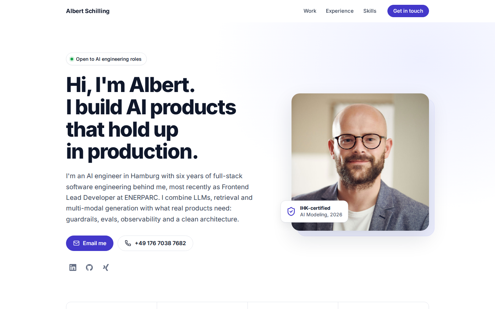
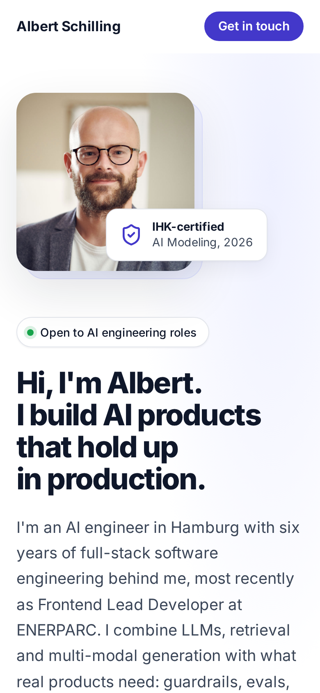

# Personal Website

The personal website of Albert Schilling, AI engineer in Hamburg with a full-stack software engineering background. It features [Bardery](https://github.com/albert-schilling/bardery), my AI storytelling app, along with my experience, skills and contact details.

**Live:** <a href="https://albert-schilling.github.io/personal-website/" target="_blank">albert-schilling.github.io/personal-website</a>

<p>
  
  &nbsp;
  
</p>

## Tech

A static site built with HTML, SCSS and vanilla JavaScript, bundled by [Parcel](https://parceljs.org/).

- No frameworks, trackers or third-party requests. The Inter font is self-hosted via [Fontsource](https://fontsource.org/).
- Responsive layout down to 320px, with keyboard-accessible navigation and a screenshot viewer.
- Respects `prefers-reduced-motion`.
- SEO: Open Graph and Twitter cards, plus JSON-LD structured data.

## Development

Requires Node.js and [pnpm](https://pnpm.io/).

```sh
pnpm install
pnpm start   # dev server on http://localhost:1234, builds into dist/
pnpm build   # production build into docs/
```

## Deployment

GitHub Pages serves the `docs/` folder from `master`. To publish changes, run `pnpm build` and commit `docs/` along with the source.

## Contact

- [Email](mailto:albertschilling@gmx.net)
- [LinkedIn](https://www.linkedin.com/in/albert-schilling/)
- [Xing](https://www.xing.com/profile/Albert_Schilling3/)
- [GitHub](https://github.com/albert-schilling)
